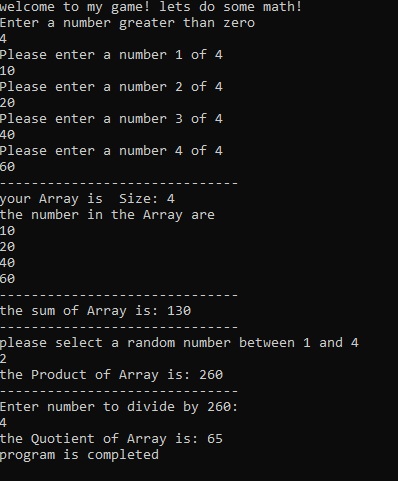

# Lab01a-NumbersGame

## The purpose of the program

- Enter a set of numbers 
- calculate (sum and product and Quotient)

### sum 
**Find the sum of the entered numbers**

### product
**The result of multiplying the sum of the entered numbers by the value of the number entered**

### Quotient
**The result of its division is the sum of the numbers entered into the value of the number entered**

## to run this program clone it and open with microsoft visual studio

##  the program look like a console game.

